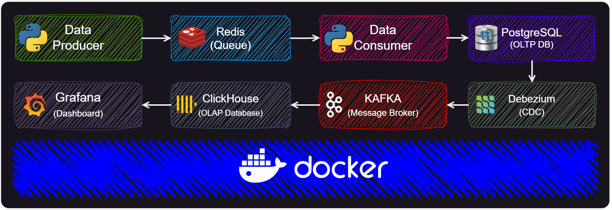

# DataEngineerGuys Workshop
## An Overview of Docker for Data Engineers
This repository hosts materials for the Docker for Data Engineers workshop, offering hands-on exercises and resources tailored for data engineering professionals.

- [Presentation Slides (download)](https://github.com/behnamyazdan/DockerForDataEngineers/blob/main/materials/DockerWorkshop_Presentation.pdf) 

## Docker images:

---
```
docker pull redis:7.2-alpine
```
```
docker pull postgres:13-alpine
```
```
docker pull quay.io/debezium/zookeeper:2.5
```

```
docker pull quay.io/debezium/kafka:2.5
```

```
docker pull provectuslabs/kafka-ui
```

```
docker pull quay.io/debezium/connect:2.5
```

```
docker pull quay.io/debezium/debezium-ui:2.5
```
```
docker pull clickhouse/clickhouse-server:23.8-alpine
```

```
docker pull grafana/grafana
```

## Create Data Pipeline:




#### 00- Create Network

```
docker network create pipeline
```


#### 01- Redis
```
docker run -d --rm --name redis --hostname redis --network pipeline -p 6379:6379 redis:7.2-alpine
```


#### 02- PostgreSQL

```
docker run -d --rm --name postgres --hostname postgres --network pipeline -p 54321:5432 -e POSTGRES_PASSWORD=postgres -e POSTGRES_DB=ecommerce_docker postgres:13-alpine postgres -c wal_level=logical
```

(wal_level=logical --> all changes made to the database are written to the WAL in a format that can be read and applied to a replica)

#### 03- zookeeper

```
docker run -d --rm --name zookeeper --hostname zookeeper --network pipeline -p 12181:2181 -p 2888:2888 -p 3888:3888 quay.io/debezium/zookeeper:2.5
```

#### 04- Kafka
```
docker run --name kafka --hostname kafka -p 9092:9092 --network pipeline --rm -d -e KAFKA_ADVERTISED_LISTENERS=PLAINTEXT://kafka:9092 -e KAFKA_LISTENERS=PLAINTEXT://kafka:9092 -e KAFKA_LISTENER_SECURITY_PROTOCOL_MAP=PLAINTEXT:PLAINTEXT -e KAFKA_INTER_BROKER_LISTENER_NAME=PLAINTEXT -e ZOOKEEPER_CONNECT=zookeeper:2181 -e KAFKA_OFFSETS_TOPIC_REPLICATION_FACTOR=1 -e KAFKA_TRANSACTION_STATE_LOG_REPLICATION_FACTOR=1 quay.io/debezium/kafka:2.5
```

#### 05- Kafka UI

```
docker run -d --rm --name kafka-ui --hostname kafka-ui --network pipeline -p 8080:8080 -e KAFKA_CLUSTERS_0_NAME=local -e KAFKA_CLUSTERS_0_BOOTSTRAPSERVERS=kafka:9092 provectuslabs/kafka-ui
```

#### 06- Debezium Connector

```
docker run --rm --name debezium --hostname debezium --network pipeline -p 8083:8083 -e GROUP_ID=1 -e CONFIG_STORAGE_TOPIC=connect_configs -e OFFSET_STORAGE_TOPIC=connect_offsets -e STATUS_STORAGE_TOPIC=connect_statuses -e BOOTSTRAP_SERVERS=kafka:9092 -e REST_HOST_NAME=debezium -e REST_PORT=8083 -e ADVERTISED_HOST_NAME=debezium -e ADVERTISED_PORT=8083 quay.io/debezium/connect:2.5
```

#### 07- Debezium UI
```
docker run -d --rm --name debezium-ui --hostname debezium-ui -p 8085:8080 --network pipeline -e KAFKA_CONNECT_URIS=http://debezium:8083 quay.io/debezium/debezium-ui:2.5
```

#### 08- ClickHouse
```
docker run -d --rm --name clickhouse --hostname clickhouse -p 8123:8123 -p 9000:9000 --network pipeline clickhouse/clickhouse-server:23.8-alpine
```

#### 09- Grafana
```
docker run -d --rm --name grafana --hostname grafana -p 3000:3000 --network pipeline -e GF_INSTALL_PLUGINS=grafana-clickhouse-datasource grafana/grafana
```